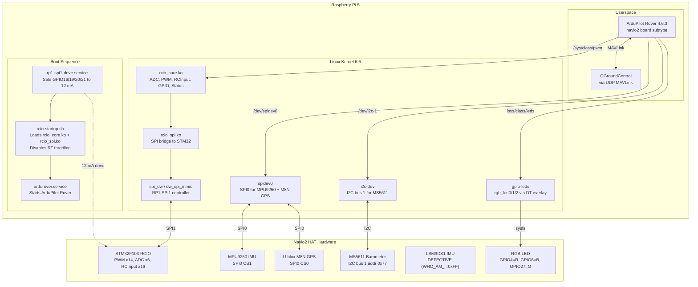
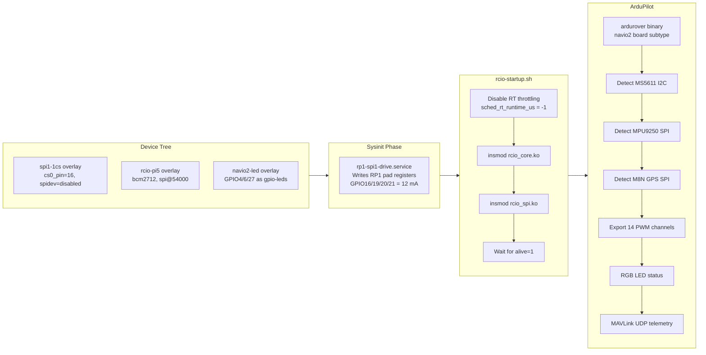
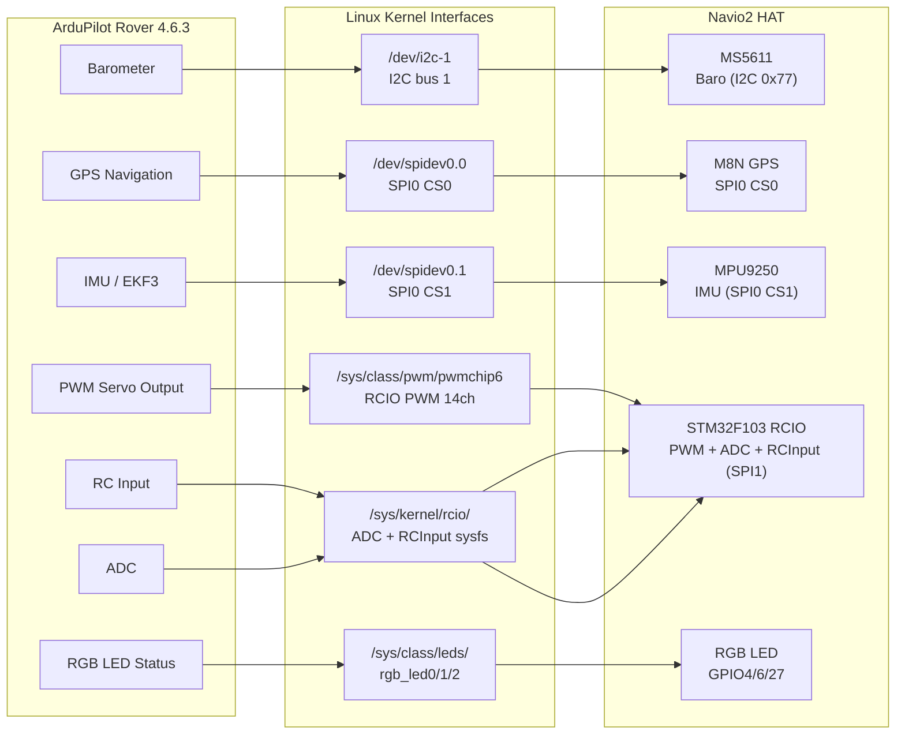
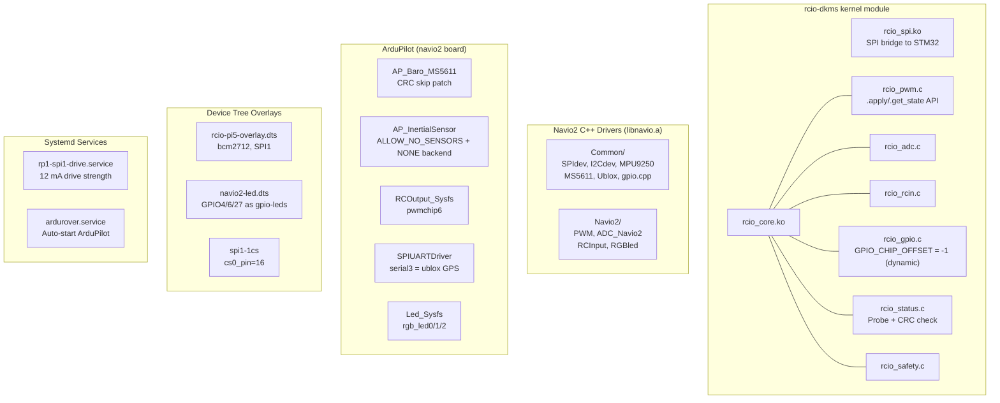

# Technical Architecture

## Document Status

`current`

## Maintenance Standard

This Markdown document with Mermaid diagrams is the source of truth for the technical architecture.

Recommended workflow:
- First edit the Mermaid blocks in this file before implementing changes.

## Architecture-Implementation Traceability Rules

1. Maintain 1:1 correspondence between architectural stages and implementation units (modules, classes or functions).
2. Use code names aligned with architectural blocks to facilitate reading and debugging.
3. Separate responsibilities by modules, files or components with clear boundaries to reduce coupling and facilitate maintenance.
4. Avoid concentrating all logic in the entry point; the main component should act as flow orchestrator.
5. If a name or stage changes in code, update in the same change the pipeline diagram, component diagram and functional blocks sections.
6. Avoid introducing cross-cutting logic that breaks the separation between defined architectural stages.
7. Any new stage must be declared first in architecture and then implemented in code.
8. If a code change affects names, stages, flow, parameters or responsibilities, review and update in the same change the related technical documentation, at minimum this document, `IMPLEMENTATION_PLAN.md` and `TECHNICAL_SETUP.md` when applicable.
9. Keep logs and errors aligned with architectural stages, using consistent prefixes or categories that facilitate traceability, debugging and flow validation.

## Team Mermaid Standard

1. Source of truth: maintain embedded diagrams in this `.md` and avoid copies in other files.
2. Visual unification: reuse the same `%%{init: ...}%%` block in all diagrams to support both light and dark modes.
3. Consistent names: use the same stage labels in diagram and text throughout the document.
4. Synchronized changes: any flow change must update at the same time the pipeline diagram, component diagram and functional blocks sections.
5. Avoid redundancies: do not repeat the same technical detail in several sections; maintain a main section and reference the others.
6. Complexity scale: if a diagram exceeds ~40 nodes, divide it into two smaller diagrams by functional domain.
7. Minimum review before closing: validate render in Markdown preview and check legibility on normal screen (without zoom).

## Objective

Describe the technical architecture of the Navio2 + Raspberry Pi 5 project: hardware abstraction layers, device communication pipeline, boot/setup sequence, and ArduPilot integration.

## System Architecture

## Boot Sequence (Pi 5 Specific)

## Technical Pipeline

## Technical Component Diagram

## Functional Blocks

### 1. Boot and Device Tree

- **Device tree overlays** loaded from `/boot/firmware/config.txt`:
  - `spi1-1cs,cs0_pin=16,cs0_spidev=disabled` — enables RP1 SPI1 with CS on GPIO16
  - `rcio-pi5` — binds RCIO driver to SPI1 device (bcm2712 compatible)
  - `navio2-led` — creates `/sys/class/leds/rgb_led{0,1,2}` from GPIO4/6/27
- **Blacklist**: `/etc/modprobe.d/blacklist-rcio.conf` prevents RCIO auto-load at boot

### 2. RP1 Drive Strength Fix

- **Component**: `/usr/local/bin/rp1-spi1-drive.py` + `/etc/systemd/system/rp1-spi1-drive.service`
- **Problem**: RP1 GPIO defaults to 4 mA; BCM2711 (Pi 4) defaults to 16 mA. Navio2 SPI traces need 12 mA for reliable STM32 communication.
- **Fix**: systemd service runs at `sysinit.target`, writes 12 mA to RP1 pad registers for GPIO16/19/20/21
- **Without this**: RCIO `alive=0` — STM32 does not respond

### 3. RCIO Kernel Module

- **Components**: `rcio_core.ko` + `rcio_spi.ko` (built from emlid/rcio-dkms with Pi 5 patches)
- **Pi 5 specific changes** (all platform-guarded):
  - `rcio_gpio.c`: `GPIO_CHIP_OFFSET = -1` (dynamic allocation — kernel picks free base, no platform guards needed)
  - `rcio_spi.c`: CS delays via `module_param()` (defaults to 0; Pi 5 passes values via `insmod`)
  - `rcio_spi.c`: `remove` return type `void` on kernel 6.2+ (`LINUX_VERSION_CODE` guard)
  - `rcio_pwm.c`: `.apply/.get_state` API (old `.enable/.disable/.config` removed in kernel 5.13+)
  - `rcio-pi5-overlay.dts`: separate overlay for Pi 5 (bcm2712)
- **Loaded by**: `/home/pi/rcio-startup.sh` (also disables RT throttling)
- **Verified state**: `alive=1`, `board_name=navio2`, `crc=0xb9064332`

### 4. RCIO Communication (SPI1)

- **Bus**: RP1 SPI1 at `/axi/pcie@120000/rp1/spi@54000` via `dw_spi_mmio` / `spi_dw`
- **Pins**: GPIO16=CS (pin 36), GPIO19=MISO (pin 35), GPIO20=MOSI (pin 38), GPIO21=SCLK (pin 40)
- **Protocol**: RCIO packet structure with CRC8, write-then-read via `spi_write_then_read()`
- **Two root causes that were fixed**:
  1. RP1 GPIO 4 mA default → 12 mA fix
  2. Ported `rcio_spi.c` sent 0xFF on MOSI during read → restored RX-only `wait_complete()`

### 5. Sensor Interfaces

| Sensor | Bus | Device | Status |
|---|---|---|---|
| MS5611 barometer | I2C bus 1 | `/dev/i2c-1` addr 0x77 | Working (CRC skip patch) |
| MPU9250 IMU | SPI0 CS1 | `/dev/spidev0.1` | Working, calibrated via QGC |
| U-blox M8N GPS | SPI0 CS0 | `/dev/spidev0.0` | Working, 3D lock 11+ sats |
| LSM9DS1 IMU | SPI0 CS2/CS3 | — | **Hardware defect** (WHO_AM_I=0xFF), auto-skipped |
| RCIO ADC | SPI1 | `/sys/kernel/rcio/adc/ch0-5` | Working |
| RCIO RCInput | SPI1 | `/sys/kernel/rcio/rcin/ch0-15` | Working |
| RCIO PWM | SPI1 | `/sys/class/pwm/pwmchip6` 14ch | Working |
| RGB LED | GPIO | `/sys/class/leds/rgb_led{0,1,2}` | Working |

### 6. ArduPilot Rover Integration

- **Binary**: `~/ardupilot/build/navio2/bin/ardurover` (navio2 board subtype, aarch64 native)
- **Source patches** (4 files, applied to ArduPilot 4.6.3):
  - `AP_Baro_MS5611.cpp` — skip PROM CRC check (Navio2 MS5611 returns CRC=0)
  - `AP_InertialSensor_config.h` — `AP_INERTIALSENSOR_ALLOW_NO_SENSORS 1`
  - `AP_InertialSensor_NONE.h/cpp` — enable NONE backend for Linux
  - `AP_InertialSensor.cpp` — warn instead of panic on missing IMU
- **Systemd service**: `/etc/systemd/system/ardurover.service` with `ExecStartPre=/home/pi/rcio-startup.sh`
- **Config**: `/etc/default/ardurover` (serial ports, telemetry IP, `--serialN` syntax)
- **Params**: `~/ardurover_work/boat_navio2.parm`
- **RT throttling**: `sched_rt_runtime_us = -1` (standard for ArduPilot on Linux)

### 7. RGB LED

- **Device tree overlay**: `navio2-led.dtbo` creates `/sys/class/leds/rgb_led{0,1,2}`
  - `rgb_led0` = Red (GPIO4)
  - `rgb_led1` = Blue (GPIO6)
  - `rgb_led2` = Green (GPIO27)
- **ArduPilot driver**: `Led_Sysfs` class writes brightness to sysfs
- **Status colors**: solid green = ready, flashing = GPS lock, etc.

### 8. ROS2 Integration (planned, not yet implemented)

- **Target**: ROS2 Jazzy + Nav2 + ArduPilot DDS + Hailo-8L inference
- **Architecture**: ArduPilot (hardware) ← DDS → Nav2 (navigation) ← ROS2 topics → Hailo (perception)
- **Current state**: ROS2 not installed; only `pymavlink` available
- **See**: `TECHNICAL_DESIGN.md` → ROS2 Integration Options

## Pi 4 vs Pi 5 Hardware Differences

| Aspect | Pi 4 (BCM2711) | Pi 5 (BCM2712 + RP1) |
|---|---|---|
| GPIO drive strength | 16 mA default | 4 mA default → 12 mA fix needed |
| SPI1 controller | BCM SoC `/soc/spi@7e215080` | RP1 `/axi/pcie@120000/rp1/spi@54000` |
| SPI1 driver | `bcm2835-aux-spi` | `dw_spi_mmio` / `spi_dw` |
| GPIO base for RCIO | 500 (no overlap) | Dynamic (`-1`) — kernel assigns 625+ |
| PWM ops API | `.enable/.disable/.config` | `.apply/.get_state` (kernel 5.13+) |
| Device tree overlay | `rcio-overlay.dts` (bcm2709) | `rcio-pi5-overlay.dts` (bcm2712) |
| Kernel | 5.x | 6.6 |

## Upstream PRs

| PR | Repo | Status | Description |
|---|---|---|---|
| [emlid/rcio-dkms#11](https://github.com/emlid/rcio-dkms/pull/11) | emlid/rcio-dkms | Open | Bugfixes: error path, PWM API, probe abort, debug messages |
| [emlid/rcio-dkms#12](https://github.com/emlid/rcio-dkms/pull/12) | emlid/rcio-dkms | Open | Pi 5 platform support (dynamic GPIO base, module_param CS delays) |
| [ArduPilot/ardupilot#33647](https://github.com/ArduPilot/ardupilot/pull/33647) | ArduPilot/ardupilot | Open | Linux bugfixes: PWM_Sysfs retry, INS NONE backend for Linux |
| [ArduPilot/ardupilot#33648](https://github.com/ArduPilot/ardupilot/pull/33648) | ArduPilot/ardupilot | Open | Navio2 Pi 5: CRC skip, allow no sensors, pwmchip, native toolchain |
| [axonbf/navio2-rpi5-ardupilot](https://github.com/axonbf/navio2-rpi5-ardupilot) | Public repo | Live | Full setup guide, scripts, overlays, documentation |